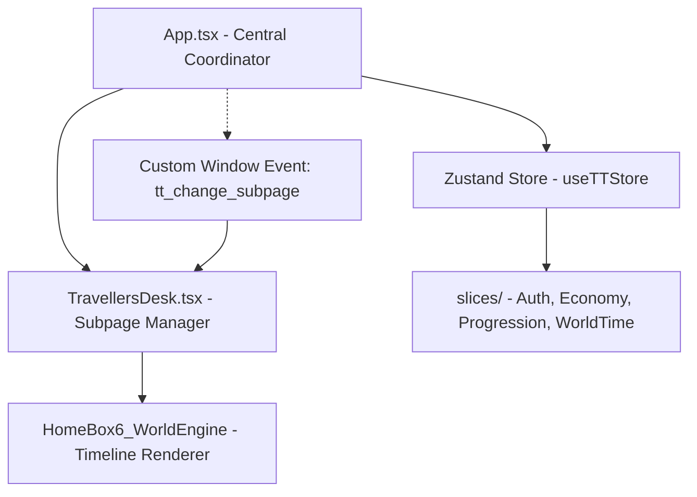

# 📜 Developer's Note: ToffeeTowns Architecture & Simulation Rules (v1.6)

Welcome to the official developer guide for **ToffeeTowns**. This document serves as the absolute source of truth for the codebase architecture, state management, economic engines, progress metrics, and UI constraints. Use this guide to maintain system integrity when extending features.

---

## 🗺️ 1. Core Architecture & State Wiring

ToffeeTowns is built as a single-page client application using **React 19**, **Vite**, **Tailwind CSS**, and **Zustand** for state orchestration.



### 📦 State Slice Layout (`useTTStore`)
Global state is coordinated by the central hook [useTTStore.ts](file:///c:/Yogesh%20Universe/TOFFEETOWNS_FUN/src/store/useTTStore.ts), which merges independent slices from the [src/store/slices/](file:///c:/Yogesh%20Universe/TOFFEETOWNS_FUN/src/store/slices/) directory:
*   **`authSlice.ts`**: Coordinates user registration, credentials validation, and authentication routing. Sets initial state from Firebase or local sandbox storage.
*   **`economySlice.ts`**: Tracks Cocoa Coins (single-wallet system), transaction history, business leases (e.g. Confectionery shop), and owned estates.
*   **`progressionSlice.ts`**: Governs legacy standing, skill experience tracks, current citizen role rank, and mailbox correspondence.
*   **`worldTimeSlice.ts`**: Ticks the clock, maps the calendar, and filters the active events timeline.

### 🔌 Window Event Broker (`tt_change_subpage`)
To decouple UI navigation from the state engine and prevent circular imports, pages communicate tab transitions using a custom browser event system:
```typescript
// Dispatching navigation requests from alert modals or cards
window.dispatchEvent(new CustomEvent('tt_change_subpage', { detail: 'classroom' }));
```
The desk layout [TravellersDesk.tsx](file:///c:/Yogesh%20Universe/TOFFEETOWNS_FUN/src/pages/TravellersDesk.tsx) registers an listener on this event to safely swap the active subpage template.

---

## 🪙 2. Currency Mechanics & Centralized Balancing

ToffeeTowns operates a single-currency economy designed with clear resource loops and centralized balancing parameters.

### 📋 Centralized Balancing (`economyConfig.ts`)
All economic values are queried from a single source of truth: [economyConfig.ts](file:///c:/Yogesh%20Universe/TOFFEETOWNS_FUN/src/constants/economyConfig.ts). This allows instant rebalancing during playtesting.

| Parameter | Key in `ECONOMY_CONFIG` | Value | Description |
| :--- | :--- | :--- | :--- |
| **Starting Coins** | `STARTING_COINS` | **100** | Initial balance for new citizens |
| **Daily Allowance** | `DAILY_ALLOWANCE` | **5** | Daily visit reward for standard citizens |
| **Resident Daily Allowance** | `RESIDENT_DAILY_ALLOWANCE` | **8** | Daily visit reward for Golden Pass holders |
| **Theatre Episode** | `THEATRE_EPISODE_COST` | **50** | Cost to unlock one standard theatre episode |
| **Festival Ticket** | `FESTIVAL_TICKET_COST` | **20** | Admission price for seasonal town festivals |
| **Horse Wagon** | `HORSE_WAGON_COST` | **3** | Caramel Wagon transit fare (Free for Pass holders) |
| **Monorail** | `MONORAIL_COST` | **5** | Glass Monorail transit fare (Free for Pass holders) |
| **Max Job Reward** | `MAX_JOB_REWARD` | **15** | Hard cap on single-shift wages (Bakery, Clinic) |
| **Market Max Reward** | `MARKET_MAX_REWARD` | **10** | Hard cap on market trades |
| **Business Yield** | `BUSINESS_YIELD_MIN` / `MAX` | **3 to 5** | Cycle payout range for leased boutique |

### 🪙 Cocoa Coins Pouch
Cocoa Coins are the primary medium of exchange. To keep inflation under control, standard activity payouts are kept under **15 Coins**.

#### Earning Sources:
1.  **Daily Visit**: Fulfilling the check-in awards **+5 Coins** (or **+8 Coins** with Golden Citizen Pass).
2.  **Bakery Shift (Oven Timing)**: Managing the bakery ovens rewards **+8 to +12 Coins**.
3.  **Market Trade**: Delivering cargo at the docks rewards **+5 to +10 Coins**.
4.  **Clinic Shift**: Brewing remedies and treating patients rewards **+8 to +10 Coins**.
5.  **Repair Work (Workshop)**: Reconstructing town infrastructure rewards **+12 to +15 Coins**.
6.  **Business Lease**: Leased shop premises yield a passive return of **+3 to +5 Coins** per cycle.

#### Spending Sinks:
1.  **Theatre Episodes**: Unlocking cinematic episodes costs **50 Coins** per episode.
2.  **Festival Tickets**: Entering seasonal fairs costs **20 Coins**.
3.  **Transit Tolls**: Traveling via Caramel Wagon costs **3 Coins** and Glass Monorail costs **5 Coins** (both are free for Golden Pass holders).
4.  **Cottage Decorations**: Purchasing furniture or items costs **20 to 300 Coins**.
5.  **Gifts for Citizens**: Gifting items to improve friendships costs **5 to 20 Coins**.
6.  **Business Lease**: Investment in a local shop lease costs **100 to 500 Coins**.
7.  **Chore Hint Unlock**: Unlocking hints in the Cottage Chore Activity HUD costs **3 Coins**.
8.  **Chore Answer Reveal**: Revealing correct answers in the Cottage Chore Activity HUD costs **5 Coins**.

---

## 🏦 3. Town Treasury Adjustment & Citizen Wallet Refresh

To prevent economic stagnation and maintain database hygiene, Toffee Towns implements a warm, storybook-style dormancy policy:

*   **Protected Subscriptions & Ranks**: Any purchased subscriptions (Golden Citizen Pass), Career levels, XP, Legacy, Friendships, owned Businesses, cottages, decorations, and theatre progress **never expire or reset**.
*   **Dormancy Timeline**:
    *   **Day 60 (*The Mayor Misses You*):** First friendly reminder is dispatched.
    *   **Day 75 (*Town Treasury Notice*):** Second/Final reminder is dispatched.
    *   **Day 90 (*Treasury Refresh*):** If the player has not logged in, their Cocoa Coin balance is adjusted back to exactly **100 Cocoa Coins** (starting balance).
*   **Return Experience**: Upon returning, the player is greeted with a warm in-universe letter from the **Town Treasury** explaining how their inactive coins helped support local festivals and railways, along with a fresh starting balance.

---

## 🏆 4. Progression, Level Thresholds & Activity Rewards

Experience (XP) points represent a resident's professional masteries, while Legacy represents community trust.

### 📈 Standardized Progression Tiers
XP and Legacy are tied together in a stable 10:3 ratio. Players climb a 6-tier civic ladder based on cumulative XP and actions:
*   **Level 1: 🌱 Newcomer** (needed: `250 XP`, `60 Legacy`) ➔ current XP `0` to `250`, Legacy `0` to `60`
*   **Level 2: 🏠 Resident** (needed: `500 XP`, `150 Legacy`) ➔ current XP `250` to `500`, Legacy `60` to `150`
*   **Level 3: 🪵 Settler** (needed: `1000 XP`, `300 Legacy`) ➔ current XP `500` to `1000`, Legacy `150` to `300`
*   **Level 4: 🏘️ Townsman** (needed: `2500 XP`, `750 Legacy`) ➔ current XP `1000` to `2500`, Legacy `300` to `750`
*   **Level 5: 🏛️ Citizen** (needed: `5000 XP`, `1500 Legacy`) ➔ current XP `2500` to `5000`, Legacy `750` to `1500`
*   **Level 6: 🏛️ Citizen** (needed: Infinity) ➔ current XP `5000+`, Legacy `1500+` (Highest civic honour & Victory!)

### 🏛️ The Immersive Town Hall Ceremony
When the player completes all required milestones for their current rank, the **"Promote to Next Rank"** button unlocks. Instead of a simple toast, the promotion is celebrated via the [AchievementEffects.tsx](file:///c:/Yogesh%20Universe/TOFFEETOWNS_FUN/src/components/desk/home/AchievementEffects.tsx) modal:
*   **Audio Chime**: A Web Audio API synthesizer plays a beautiful arpeggio of C5 (`523.25Hz`), E5 (`659.25Hz`), G5 (`783.99Hz`), a bright C6 (`1046.50Hz`) triangle wave bell strike, and a lingering E6 (`1318.51Hz`) sparkle.
*   **Visual Ceremony**: Uses an HTML5 `<canvas>` rendering 180 physics-based exploding confetti particles, a constant flow of floating golden fireflies, and a rotating sunbeam overlay behind a large spinning civic badge.
*   **Dynamic Unlocks**: Displays a custom bulleted list detailing exactly what new areas, transit lines, jobs, and privileges have been unlocked at the Town Hall for that specific rank.

---

## 📅 5. Daily Loop, Time Blocks & Timeline

The environment is driven by a deterministic calendar and a synchronized time-of-day loop.

### 📆 The Deterministic Calendar
The daily newspaper headline, market rates, and weather patterns are bound to a 10-day rotation index computed from the local system date:
$$\text{dayIndex} = (\text{new Date().getDate()} \pmod{10}) + 1$$

Weather profiles are mapped deterministically to this calendar cycle:
*   **Sunny (Days 1, 2, 3)**: Mapped to `WORLD_EVENTS_SUNNY`. Low transit delays, busy outdoor market square stalls, and open-air theater sessions.
*   **Stormy (Days 4, 5)**: Mapped to `WORLD_EVENTS_STORMY`. Spore sneezle outbreaks, rain delays, and indoor classroom lectures.
*   **Migration (Days 6, 7)**: Mapped to `WORLD_EVENTS_MIGRATION`. Shimmering fluttermoth arrivals, night ruin guided tours, and herbal remedies demand spikes.
*   **Festival (Days 8, 9, 10)**: Mapped to `WORLD_EVENTS_FESTIVAL`. Clock spire restoration carnivals, copper bracket donations, and celebratory bun baking.

### ⏱️ The 8-Block Daily Timeline
Every 24-hour cycle is split into 8 contiguous 3-hour blocks, visualized in the world engine timeline:
1.  **00:00 - 03:00** (*Midnight Bell*): Night Curfew.
2.  **03:00 - 06:00** (*Sunrise Bell*): Dawn Patrol.
3.  **06:00 - 09:00** (*Sunrise Bell*): Morning Market Setup.
4.  **09:00 - 12:00** (*Morning Bell*): School Lecture.
5.  **12:00 - 15:00** (*Warm Sunshine*): Afternoon Chores.
6.  **15:00 - 18:00** (*Warm Sunshine*): Evening Play.
7.  **18:00 - 21:00** (*Sunset Bell*): Dinner Gathering.
8.  **21:00 - 00:00** (*Curfew Bell*): Night Stroll.

---

## 🚨 6. Simulation Popups, Warnings & Audio Alerts

A background supervisor loop inside [App.tsx](file:///c:/Yogesh%20Universe/TOFFEETOWNS_FUN/src/App.tsx) polls the time-clock state every 15 seconds to trigger alerts for timeline events.

### 🎛️ Alert Triggers
*   **Upcoming (10 minutes before)**: Fires exactly 10 minutes prior to a block's starting hour (e.g. `08:50` for a `09:00` block). Triggers a double-chirp warning sound (`800Hz`) and shows a temporary alert warning.
*   **Live (On-Time)**: Fires exactly at the start minute of the block. Triggers a high-frequency chime arpeggio and pops up an invitation card.
*   **Local Storage Keys**: To prevent duplicate triggers, events are flagged in `localStorage` using the pattern:
    `tt_sim_alert_${time}_${title}_${alertType}_${dateString}`

### 🛡️ Spam Protections
*   **Cooldown Gap**: A minimum interval of **20 minutes** is enforced between alert popups to prevent message overlap.
*   **Auto-Dismiss Lock**: Alert modals automatically close after **90 seconds** of inactivity to clear the screen area.

---

## 👥 7. Character Registry & Dialogue Lore

Dialogue parsing relies on absolute name matching. Do not modify or introduce typos to the names of the 10 core townspeople:

| Name | Role | Location | Dialogue Keys |
| :--- | :--- | :--- | :--- |
| **Sir Goldwhistle** | Tax Collector | Town Hall | `tax`, `coin`, `audit`, `ledger` |
| **Baker Bramble Mortimer** | Head Baker | Bakery Stalls | `bread`, `baking`, `yeast`, `oven` |
| **Captain Winston Butterfield** | Explorer | Harbor Docks | `voyage`, `sea`, `map`, `discover` |
| **Mrs. Petalworth** | Florist | Green Meadows | `flower`, `lily`, `seed`, `grow` |
| **Dr. Cedric Oakenhart** | Physician | Clinic Sanctuary | `remedy`, `health`, `potion`, `sickness` |
| **Professor Finley** | Academy Principal | School Classroom | `lecture`, `book`, `exam`, `study` |
| **Blacksmith Crumblewise** | Metal Forge Master | Mountain Smelter | `iron`, `forge`, `brass`, `hammer` |
| **Rowan Thistle** | Builder Apprentice | Workshop Shed | `wood`, `build`, `bridge`, `plank` |
| **Marshal Frill** | Sheriff Deputy | Security Outpost | `sheriff`, `bylaws`, `patrol`, `safety` |
| **Marshal Qrill** | Sheriff Deputy | Security Outpost | `sheriff`, `bylaws`, `patrol`, `safety` |

---

## 📐 8. Layout & UI Guidelines

All visual blocks must adhere to our cozy design system:
*   **Standard Panels**: Width of `92vw` and height of `92vh` (with main header) or `96vh` (standalone). Background styling uses `bg-black/60` with a thin border `border-white/10` and rounded corners `rounded-[2rem]`.
*   **Glassmorphic Overlay Exception**: Pre-game briefing screens or modal overlays where the background wallpaper must shine through use a premium translucent glass style: `background: 'rgba(0, 0, 0, 0.65)'` with `backdrop-filter: blur(16px)` and rounded corners.
*   **Pop-up Modals**: Standalone dialog cards are sized at `85vw` width by `85vh` height. Backdrops must be clear or lightly tinted (`bg-black/10` or `bg-transparent`) with **strictly zero backdrop blurs**.
*   **Cottage Chore HUD Modal Exception**: The Cottage Chore Activity HUD modal is custom-sized to exactly `70vw` width by `70vh` height with a standard font size of `15px` (`text-[15px]`) for all descriptive content and action buttons.
*   **Image Slots**: Standard horizontal slots must match a **3:2 aspect ratio** with edge-to-edge cropping (`object-cover`).
*   **Copy Standard**: Every newly introduced card or subpage must open with a **3-line header description** detailing what the area is and what actions the resident is expected to perform.
*   **Forbidden Terms**: Do not use the words `dispatch` or `despatch` in user-facing buttons or headers. Instead, use `bulletin`, `activities`, or `chores`.

---

## 📊 9. Production Build & Linter Validation Status

### 📦 Build Sizes
The production build compiles successfully via Vite. Output assets:
*   `dist/index.html` (1.24 kB)
*   `dist/assets/index-BadkkBh5.css` (205.67 kB)
*   `dist/assets/index-BE3NzQkY.js` (2,220.23 kB)
*   **Transformed Modules**: 701 modules compiled in **25.07 seconds**.

### 🔍 Code Quality Audit
As of the latest code cleanup:
*   **TypeScript Compiler (`tsc -b`)**: 0 errors.
*   **ESLint Audit (`npm run lint`)**: 0 errors, 0 warnings.
*   **React Hook Purity**: All Math.random/Date.now rendering calls have been refactored to static generators or lazy initializers (`useState(() => value)`).
*   **Variable Declarations**: All variables comply with block scoping; unused variables have been cleaned.
