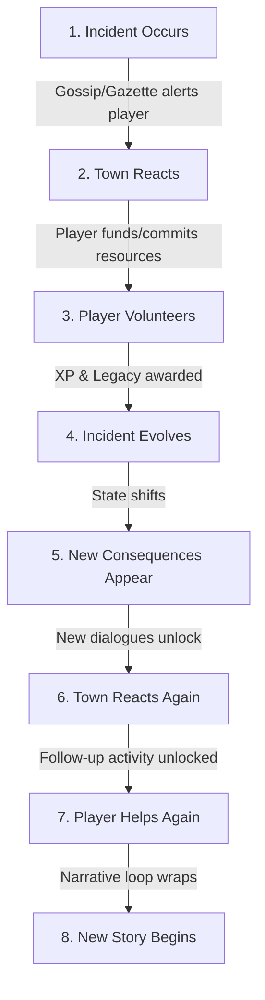

# Ganache Grove Town Narrative & Logic Blueprint

This document details the architectural blueprint of Ganache Grove's narrative loop, progression mechanics, and community involvement. It defines the design philosophy shifting the game from simple quest-completion patterns to an evolving, consequence-driven living simulation.

---

## 1. Core Philosophy: The Living Canopy

Traditional RPGs operate on a mechanical loop:
```
Quest ➔ Complete ➔ Reward ➔ Next Quest
```
Ganache Grove implements a consequence-driven loop where the town reacts and evolves dynamically:
```
Incident Occurs ➔ Town Reacts (Gossip/News) ➔ Player Volunteers ➔ Incident Evolves ➔ New Consequences & Reaction ➔ Secondary Volunteer Matter ➔ New Story Begins
```

The story never truly ends because every action taken by the player creates ripples that shape the town’s state and trigger subsequent dilemmas.

---

## 2. The Narrative Pipeline

Every story progression follows this structured pipeline:



### Stage Description:
1. **Incident Occurs:** A real event happens in the grove (e.g., elevated river waters, glowing mushroom outbreaks).
2. **Town Reacts:** Residents discuss the incident. Dr. Cedric Oakenhart publishes warnings, or local gossip circles whisper about it.
3. **Player Volunteers:** The player volunteers resources (Coins or inventory items) and completes daily chores to handle the immediate pressure.
4. **Incident Evolves:** The task is solved, but the resolution exposes or causes a new complication.
5. **New Consequences Appear:** The town's physical or economic state shifts. Built assets have unintended side-effects.
6. **Town Reacts Again:** Resident dialogue and news feed update to reflect the new state of the town.
7. **Player Helps Again:** The player addresses the secondary consequence.
8. **New Story Begins:** Completing the chain resolves the overarching issue and sows the seeds for the next season's incident.

---

## 3. Data Structure Design (`TownActivity`)

The code structure in `src/data/towns/ganache-grove/problems.ts` is updated to support this evolutionary pipeline:

```typescript
export interface TownActivity {
  id: string;
  title: string;
  category: 'project' | 'mystery' | 'health' | 'market' | 'trade';
  description: string;
  requirementsSummary: string;
  costCheck: (inventory: any, coins: number) => boolean;
  execute: (inventory: any, coins: number) => {
    deductions: { coins: number; inventory: Record<string, number> };
    xp: { skill: string; amount: number };
    legacy: number;
    consequenceTitle: string;
    consequenceText: string;
    unlockedIncidentId?: string; // Triggers the next stage of the storyline
  };
  stage?: number; // 1, 2, or 3
  townReactionBefore?: string; // Initial reaction/dialogue from town residents
  parentIncidentId?: string; // Reference to the origin incident in the chain
}
```

---

## 4. Current Narrative Chains

### Chain A: The Great Canopy Walkway & The Stolen Key (Infrastructure & Mystery)
1. **Support Walkway Project (`walkway`)**
   - *Reaction:* Forester Sir Goldwhistle reports visitors sinking in chocolate mud.
   - *Evolution:* The walkway is successfully elevated, but it cuts directly through a hollow root where sacred canopy squirrels nest.
2. **Relocate Canopy Squirrels (`walkway_squirrels`)**
   - *Reaction:* Hyperactive squirrels are nesting on the handrails and pelting visitors with cocoa pods.
   - *Evolution:* Squirrels are safely moved to the lower thicket, but they drop a stolen ancient key they were hoarding.
3. **Unlock the Forgotten Hatch (`stolen_key_mystery`)**
   - *Reaction:* A golden metal hatch is uncovered under the roots, matching the stolen key.
   - *Evolution:* The hatch is unlocked, revealing a dry underground archive of pre-flood cocoa recipes, starting a new bakery era.

### Chain B: The Moss Sneezles Epidemic (Health & Ecology)
1. **Moss Sneezles Campaign (`sneezles`)**
   - *Reaction:* Dr. Cedric Oakenhart warns that tree-hugging has caused a rash of damp allergy symptoms.
   - *Evolution:* Pamphlets are distributed, but we discover the allergen is a species of glowing fungal spore.
2. **Neutralize Glow-Spore Clusters (`fungus_control`)**
   - *Reaction:* Glowing spores in Sector 4 are causing glowing green sneezes at midnight.
   - *Evolution:* Spores are neutralized, but they were the sole food source of the native Glowcap Snails.
3. **Establish Snail Refuge (`snail_sanctuary`)**
   - *Reaction:* Starving snails are migrating into Baker Mortimer's flour barrels.
   - *Evolution:* A sanctuary is built, balancing the canopy ecosystem and restoring health.

### Chain C: Cargo Flow & Market Demands (Trade & Economy)
1. **Dredge River Route (`dredging`)**
   - *Reaction:* Silt blocks cargo boats carrying cocoa butter downstream.
   - *Evolution:* River is cleared, but the heavy dredging creates an overflow at the lower molasses locks.
2. **Reinforce Molasses Locks (`locks_reinforcement`)**
   - *Reaction:* Thicker molasses is spilling over into the lower gardens, threatening agricultural fields.
   - *Evolution:* Locks are reinforced, but the backlog creates an immediate demand for transport wagons.
3. **Express Pod Delivery (`delivery`)**
   - *Reaction:* Confectioners in the capital are begging for the backlogged beans.
   - *Evolution:* Wagons deliver the beans, boosting trade legacy and establishing a permanent trade lane.

---

## 5. Progression & Point Mechanics

- **Cocoa Coins (Financial Capital):** Used to fund operations and skip transit times. Solvency is required for residency status.
- **Skill XP (Professional standing):** Earned through specific activities (e.g. Builder, Explorer, Healer). Determines career choices.
- **Legacy Points (Civic Standing):** The ultimate measure of a citizen's contribution to the town's evolution. High legacy unlocks advanced manor upgrades, town hall votes, and permanent citizen status.
